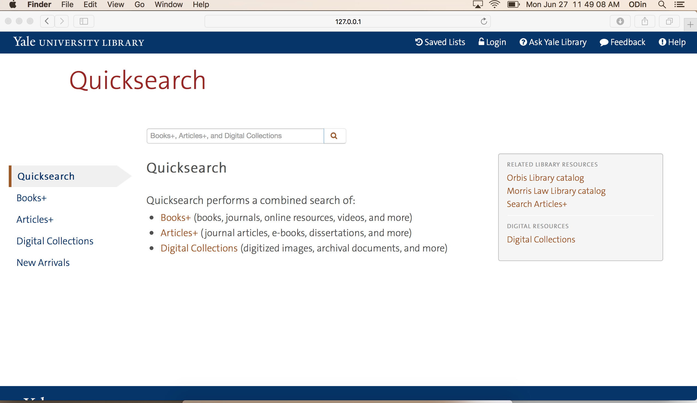

# Quicksearch Vagrant Setup

The project creates the full development stack (CentOS 7, rvm, Ruby, MySql, PostgreSql, Oracle Instant Client), combines the three Quicksearch repos (search-frontend,
search-backend, quicksearch-morris), and installs any required gem dependencies.

It tries to replicate the existing stack -- therefore, there might be opportunities for improvements (e.g., removing unnecessary libraries or adding additional useful libraries). The installation script will continue evolving (to add config, comply with best practices, etc.). 

In future, this repo's setup would likely get assimilated into the individual QS projects, along the style of the rubymine-vagrant project. 


## Steps

As documented in this section, clone this repo, export your key, and run vagrant up. The first time VM will take about 10-15 minutes. The setup picks up ominauth.yml from your computer, but add other YAML config files if necessary.

Before you begin:

1. Make sure you have set up your key in GitHub [1].
2. Copy the quicksearch ominauth.yml file to /tmp folder. 

Finally:

```
git clone git@github.com:yalelibrary/quicksearch-vagrant.git
cd quicksearch-vagrant
key=~/.ssh/id_rsa
[[ -z $(ssh-add -L | grep $key) ]] && ssh-add $key
vagrant up
# observe message "==> default: Done. Happy coding!"
vagrant ssh

# start any repo that frontend relies on, if necessary
cd /home/vagrant/search-backend
rails s -p8080 &
cd /home/vagrant/search-frontend
# start rails
rails server -b 0.0.0.0

```

Quicksearch should be visible now at: http://127.0.0.1:3000




## References

[1] https://help.github.com/articles/generating-a-new-ssh-key-and-adding-it-to-the-ssh-agent/
